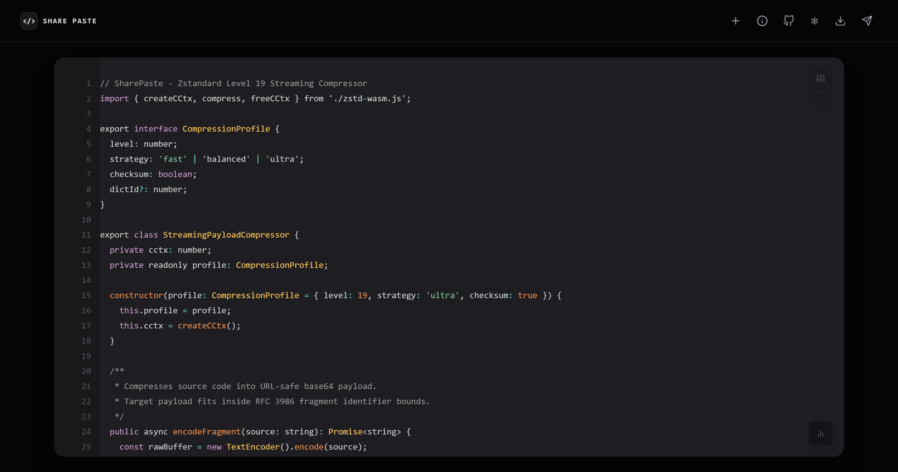
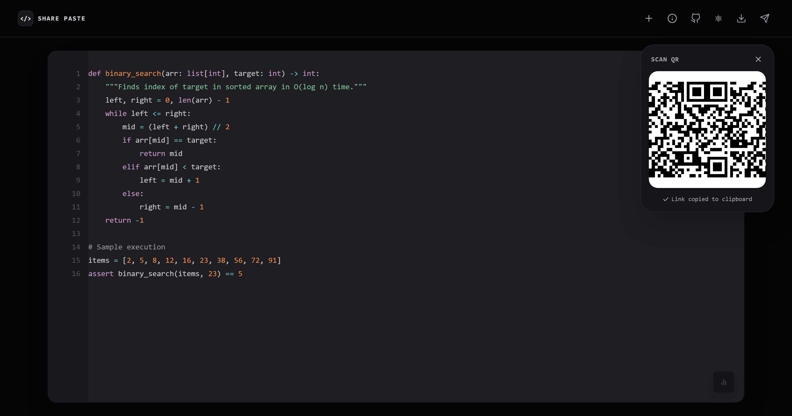
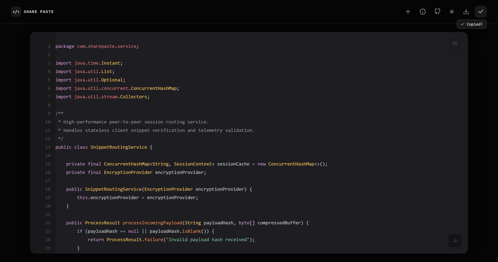
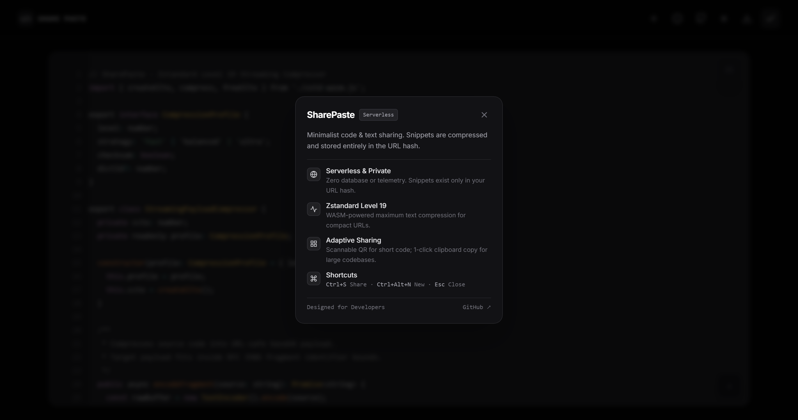

# SharePaste

[](https://github.com/sidhu1512/SharePaste/actions/workflows/ci.yml)
[](https://github.com/sidhu1512/SharePaste)
[](LICENSE)
[](https://github.com/sidhu1512/SharePaste/stargazers)
[](https://sidhu1512.github.io/SharePaste)
[](https://sidhu1512.github.io/SharePaste/app.html)

A high-performance, minimalist, **serverless** code and text sharing tool. Paste your code, copy the link, and share instantly. Everything is compressed with **Zstandard (Level 19)** and encoded directly into the URL hash — zero databases, zero tracking, 100% private.

**[Official Website](https://sidhu1512.github.io/SharePaste)** &bull; **[Launch Web App](https://sidhu1512.github.io/SharePaste/app.html)**

---

## Overview

<p align="center">
  
</p>

SharePaste eliminates backend dependencies and storage limits by treating the client URL hash as the single source of truth. Snippets load instantly and remain accessible indefinitely without expiring on a remote server.

---

## Key Features & Visual Walkthrough

### 1. Adaptive Sharing Experience

SharePaste dynamically adapts how links are shared based on payload length to guarantee optimal mobile scannability and frictionless clipboard copying:

|                                                                            Short Snippets (≤ 350 chars)                                                                            |                                                                                       Large Codebases (> 350 chars)                                                                                       |
| :--------------------------------------------------------------------------------------------------------------------------------------------------------------------------------: | :-------------------------------------------------------------------------------------------------------------------------------------------------------------------------------------------------------: |
|                                                                                                                           |                                                                                                                                                  |
| **High-Contrast Level L QR Code**<br>Renders a low-density QR code with large modules ($\ge 2.6\text{ px/module}$) that iPhone and Android cameras can scan off computer monitors. | **Direct 1-Click Copy & Inline Feedback**<br>Suppresses dense, unreadable QR codes. Instantly copies the link to the clipboard and gives visual confirmation with an inline checkmark and `Copied!` pill. |

---

### 2. Privacy & Serverless Architecture

Snippets never touch a backend database, analytics script, or third-party storage service. All data is compressed on the client using WebAssembly and stored directly in `#` (the URL fragment identifier), which browsers never transmit over HTTP requests.



---

### 3. Zstandard Level 19 WebAssembly Compression

Under the hood, SharePaste uses Facebook's industry-leading **Zstandard (zstd)** algorithm compiled to WebAssembly. By running compression at **Level 19**, large multi-line source files (such as 60+ line Java or TypeScript classes) are compressed into ultra-compact URL hashes that fit neatly within browser URL limits.

---

### 4. Developer Ergonomics

- **Smart Auto-Detection & Syntax Highlighting:** Automatically detects JavaScript, TypeScript, Python, Java, Rust, Go, C/C++, HTML/XML, CSS, SQL, JSON, Markdown, and Bash, with manual override.
- **Intelligent Indentation:** Preserves indentation on `Enter` and automatically indents after `{`, `:`, `(`, and `[`.
- **Tab & Shift+Tab:** Indents and unindents with 4 spaces.
- **Collapsible Floating Toolbar & Status Bar:** Subtle, non-intrusive floating bars that expand on hover to keep your workspace distraction-free.
- **File Drag & Drop:** Drop any source code file directly onto the editor to load it.
- **Theme Customization:** Switch between developer themes (Tomorrow, Okaidia, Twilight, Funky).
- **Word Wrap & Line Numbers:** Toggle soft wrapping and line numbers with a single click.

---

## Keyboard Shortcuts

| Shortcut                                                       | Action                                                          |
| :------------------------------------------------------------- | :-------------------------------------------------------------- |
| <kbd>Ctrl</kbd> + <kbd>S</kbd> / <kbd>Cmd</kbd> + <kbd>S</kbd> | **Share & Copy** (Trigger adaptive share action)                |
| <kbd>Ctrl</kbd> + <kbd>Alt</kbd> + <kbd>N</kbd>                | **New Snippet** (Open fresh snippet in a new tab)               |
| <kbd>Tab</kbd> / <kbd>Shift</kbd> + <kbd>Tab</kbd>             | **Indent / Unindent** (4 spaces)                                |
| <kbd>Esc</kbd>                                                 | **Dismiss** (Close QR popup, About modal, or language dropdown) |

---

## Tech Stack

- **Frontend:** Vanilla JavaScript (ES Modules), HTML5, Tailwind CSS
- **Compression Engine:** `@bokuweb/zstd-wasm` (Zstandard Level 19 compiled to WebAssembly)
- **Syntax Highlighting:** Prism.js (Autoloader with language auto-detect)
- **QR Engine:** QRCode.js (High-contrast Error Correction Level L)

---

## Running Locally

Because SharePaste loads WebAssembly modules (`zstd.wasm`), it must be served over HTTP rather than `file://`:

1. Clone the repository:

   ```bash
   git clone https://github.com/sidhu1512/SharePaste.git
   cd SharePaste
   ```

2. Start a local HTTP server:

   ```bash
   # Using Python 3
   python -m http.server 8000
   ```

   _Or use the VS Code "Live Server" extension._

3. Open your browser at **`http://localhost:8000`**.

---

## License & Credits

- Created by **Siddharth Bhadu**
- Open Source under the [MIT License](LICENSE).
